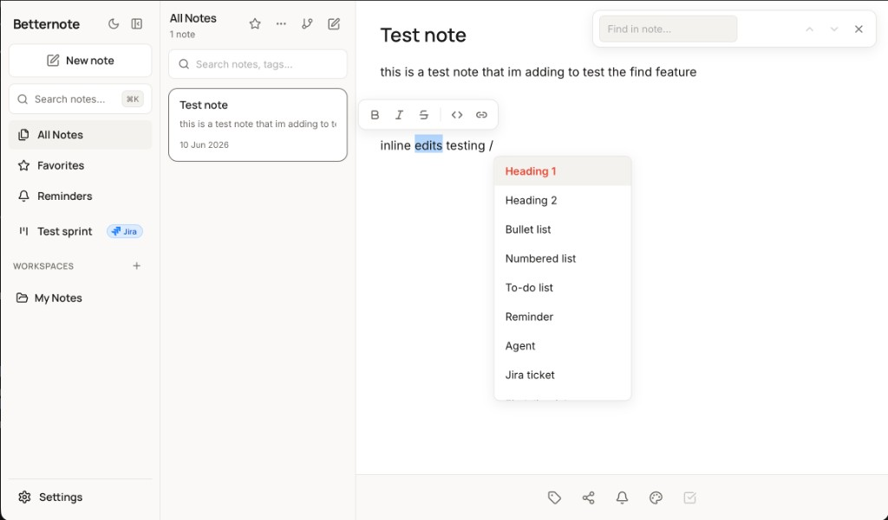
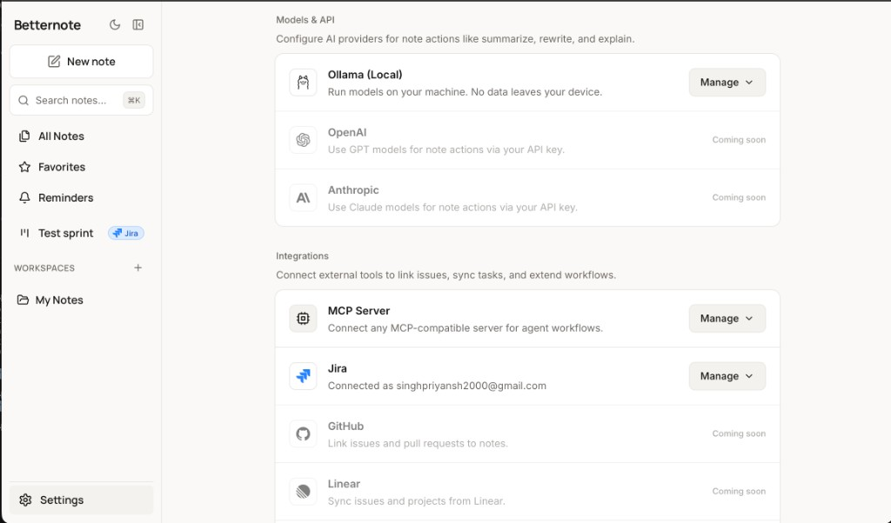
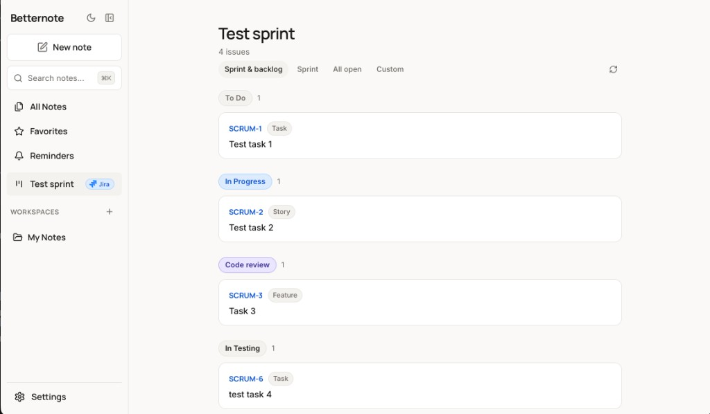
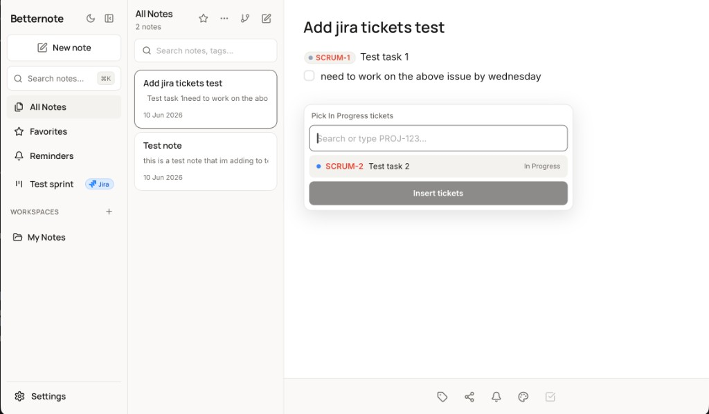

# Betternote

A **local-first notes app for developers** on macOS. Fast editor, wiki links, backlinks, quick capture, and privacy controls — with optional local AI and integrations.

No backend. No login. Your notes stay on your machine.



## Download

**[Download Betternote.dmg](https://github.com/leviackerman05/Betternotes/releases/latest/download/Betternote.dmg)** (macOS, Apple Silicon)

1. Open the DMG and drag **Betternote** into **Applications** (installs to `/Applications/Betternote.app`).
2. Open Betternote from Applications.

Older releases and release notes: [GitHub Releases](https://github.com/leviackerman05/Betternotes/releases).

Betternote is not Apple-notarized, so macOS may block the first launch. If you see **"damaged"** or the app will not open:

- **Right-click** `/Applications/Betternote.app` → **Open** → confirm once, or
- Run in Terminal: `xattr -cr /Applications/Betternote.app`

After that, double-click works normally.

<details>
<summary>Optional: terminal install script</summary>

If you prefer the terminal, [`scripts/install-macos.sh`](scripts/install-macos.sh) can download the latest release, install to Applications, and clear quarantine for you:

```bash
curl -fsSL https://raw.githubusercontent.com/leviackerman05/Betternotes/main/scripts/install-macos.sh | bash
```

</details>

## Features

### Notes & editor

- **Workspaces & organization** — folders, tags, favorites, pins, archives, note colors
- **Rich editor** — headings, bullet/numbered/to-do lists, reminders, inline formatting
- **Selection toolbar** — bold, italic, strikethrough, inline code, and links on text selection
- **Slash commands** (`/`) — headings, lists, reminders, and more without leaving the keyboard
- **Wiki links & backlinks** — link notes with `[[Note title]]`; see which notes link back
- **Note graph** — visualize connections between notes
- **Find in note** (`⌘F`) — search and jump between matches inside the current note
- **Quick capture** — `⌘N` or command palette (`⌘K`) to create notes fast
- **Global search** — find notes by title or content from anywhere (`⌘K`)
- **Reminders** — schedule one-off or repeating reminders with native notifications
- **Note lock** — password-protect sensitive notes (encrypted locally)
- **Export** — copy, download, or print notes as Markdown or plain text

### Privacy

- **Local Only Mode** (on by default) — blocks all outbound network calls until you opt in
- All notes and settings stored on your machine (path shown in Settings → Privacy)
- Integrations and AI require explicit enablement in Settings

### Models & API



- **Ollama (local)** — run models on your machine for summarize, rewrite, extract tasks, and explain
- **OpenAI** and **Anthropic** — coming soon (cloud models via your API key)

### Integrations

- **Jira** — sprint board in the sidebar, ticket chips in notes, slash commands to insert or search tickets, and create issues from notes
- **MCP Server** — connect any MCP-compatible server for agent workflows in notes (`/agent`)
- **Coming soon** — GitHub, Linear, Notion, Trello, HacknPlan, Google Sheets

#### Jira





- Sidebar section for your sprint/backlog (customizable title and JQL filters)
- Kanban-style view grouped by status (To Do, In Progress, Code review, etc.)
- Embed live ticket chips in notes; pick tickets by status or search `PROJ-123`
- Slash commands: `/ticket`, `/ticket-find`, `/ticket-in-progress`, `/sprint`, and more

## Keyboard shortcuts

| Shortcut | Action |
|----------|--------|
| `⌘K` | Search notes & commands |
| `⌘F` | Find in note |
| `⌘N` | Quick capture: new note |
| `⌘B` / `⌘I` | Bold / italic (in editor) |
| `G` then `N` | Go to Notes |
| `G` then `S` | Go to Settings |
| `/` | Slash commands in editor |
| `[[` | Wiki link autocomplete |

## Development

```bash
npm install
npm run tauri dev
```

For correct Dock icon sizing during dev:

```bash
npm run dev:app
```

## Building

```bash
npm run tauri build
```

Produces a `.dmg` in `src-tauri/target/release/bundle/dmg/`. See [docs/RELEASING_MACOS.md](docs/RELEASING_MACOS.md) for tagging and publishing releases.

## Optional: Local AI (Ollama)

1. Install [Ollama](https://ollama.com)
2. Pull a model: `ollama pull qwen2.5:7b`
3. In **Settings → Models & API**, disable **Local Only Mode** (Privacy section) if needed
4. Connect **Ollama** and choose your endpoint and default model

Use `/agent` in a note when MCP is enabled for agent workflows powered by your local model.

## Optional: Jira

1. In **Settings**, disable **Local Only Mode** if it is on
2. Under **Integrations**, connect **Jira** and add site URL, email, API token, and default project key
3. A Jira section appears in the sidebar — sync issues and open the sprint board
4. In notes, type `/ticket` or paste a key like `SCRUM-1` to embed ticket chips

## Optional: MCP

1. Disable **Local Only Mode** in Settings
2. Connect **MCP Server** and configure the command, args, and env for your server
3. Use `/agent` slash command in notes for MCP-powered workflows

## Tech stack

- **Tauri v2** (Rust + native webview)
- **React 19 + TypeScript + Vite**
- **SQLite** (local storage with migrations)
- **TipTap** (rich-text editor with custom extensions)
- **Ollama** (optional local LLM)
- **MCP** (optional agent connector)

## Privacy

- All notes and settings stored locally on your machine (path shown in Settings → Privacy)
- **Local Only Mode** is on by default. No outbound network calls.
- Jira credentials stored via macOS keychain; locked note content encrypted locally
- Integrations require explicit opt-in in Settings
